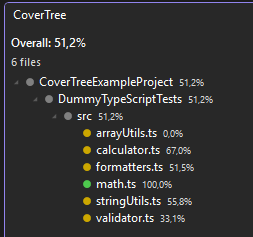
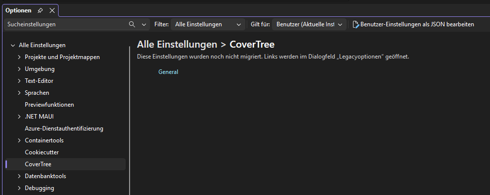

# CoverTree

[](https://github.com/WalSplitter/covertree-vs/actions/workflows/ci.yml)
[](LICENSE)
[](https://visualstudio.microsoft.com/)

Visual Studio 2022 extension that shows Jest/Vitest/NYC code coverage in a dedicated tree window, inline in Solution Explorer, and line-by-line in the editor gutter.

This is a port of the [CoverTree VS Code extension](https://github.com/WalSplitter/covertree-vscode) for Visual Studio.

## Features

### CoverTree Tool Window

A dedicated tree view (`View > Other Windows > CoverTree`) mirrors your project structure — folders and files, exactly as shown in Solution Explorer — with a coverage percentage and color-coded status dot on every node.

- 🟢 green — coverage at or above the threshold (default 75%)
- 🟡 yellow — coverage below the threshold
- Double-click a file to open it



Coverage files are discovered automatically: the extension recursively scans the whole solution/workspace for `coverage-summary.json` / `coverage-final.json`, wherever they live (e.g. nested inside a sub-project's own folder), skipping `node_modules`, `.git`, `bin`, `obj`, and similar noise directories. No manual path configuration is needed for the common case.

### Solution Explorer Integration

Every covered source file gets an expandable **Coverage** child row directly in Solution Explorer, showing the per-file breakdown:

```
🟢 CoverTree: 87.3%  Lines 90%  Fn 82%  Br 85%
```

### Editor Gutter Markers

Open any covered file to see line-level coverage directly in the editor margin.

| Color     | Meaning                                  |
| --------- | ----------------------------------------- |
| 🟩 Green  | Line fully covered                       |
| 🟥 Red    | Line not covered                         |
| 🟨 Yellow | Partially covered (branch not fully hit) |

### Navigate Uncovered Lines

Jump straight to the next or previous uncovered line in the active file — no need to scroll and hunt through the gutter.

### Status Bar

Overall coverage across all discovered files is shown in the status bar at all times.

## Requirements

Your project must run Jest/Vitest/NYC with the `json-summary` (and, for gutter markers, `json`) coverage reporter enabled:

```js
// jest.config.js / vitest.config.ts
{
  coverageReporters: ['json-summary', 'text', 'json'];
}
```

Then generate coverage data:

```bash
npx jest --coverage
# or
npx vitest run --coverage
```

This produces:

- `coverage-summary.json` — used for the tree window, Solution Explorer rows, and status bar
- `coverage-final.json` — used for editor gutter markers

Works both with a Visual Studio Solution (`.sln`) and with **File > Open Folder** — the coverage scan always starts at the solution/folder root.

## Configuration

Settings are available under **Tools > Options > CoverTree**:



| Setting               | Default                     | Description                                                                 |
| ---------------------- | ---------------------------- | ----------------------------------------------------------------------------- |
| Threshold (%)          | `75`                         | Minimum coverage % for the passing (green) indicator                        |
| Coverage Summary File  | `coverage/coverage-summary.json` | File name searched for recursively under the solution root              |
| Coverage Detail File   | `coverage/coverage-final.json`   | File name searched for recursively, used for gutter markers             |
| Show Gutter Markers    | `true`                       | Enable/disable editor gutter markers                                        |

Only the file *name* is used for the search (e.g. `coverage-summary.json`) — the folder portion of the default value is ignored, since coverage output is located automatically regardless of which sub-project folder it lives in.

## Commands

| Command                          | Keybinding    | Description                                        |
| --------------------------------- | ------------- | --------------------------------------------------- |
| CoverTree: Refresh Coverage       | —             | Reload coverage data from disk                     |
| CoverTree: Show Coverage          | —             | Show the coverage summary for the selected file in the status bar |
| Go to Next Uncovered Line        | `Alt+Shift+N` | Jump to next uncovered line in the active file     |
| Go to Previous Uncovered Line    | `Alt+Shift+P` | Jump to previous uncovered line in the active file |

## Development

Open `CoverTree.VS.sln` in Visual Studio 2022 with the **Visual Studio extension development** workload installed. Press `F5` to launch the experimental instance.

See [CLAUDE.md](CLAUDE.md) for the project structure and key GUIDs.

## License

MIT
